# 🧠 GenAI Mind Map Flow Builder (Gnosis)

**GenAI Mind Map Flow Builder** is a cutting-edge, AI-powered tool designed to convert complex, multi-format data into structured, interactive mind maps. Powered by LLMs like OpenAI GPT-4o and Google Gemini, it allows users to process, query, visualize, and summarize knowledge extracted from diverse sources.

## 📺 Watch Demo on YouTube
[](https://youtu.be/sxvKbQI7Wl0)
---

## 🚀 Key Features

### 🔗 **Multi-Source Data Integration**
- Upload or connect multiple data sources including:
  - Documents, csv, web pages, databases, images, audio, and video
- Add unlimited data sources in one flow
- Reuse and interlink previous answers

### 🧠 **AI-Powered Mind Map Generation**
- Uses OpenAI GPT-4o and Google Gemini to:
  - Extract data insights and visualize them with graph and dataframes (tables)
  - Ask multiple questions on multiple data sources
  - Generate mind maps automatically for single data source
  - Prepare PDF Report for the entire flow

### 🧭 **Two Mind Map Modes**
- **Automatic Mode**:
  - Upload any one source
  - Mind map and summaries are auto-generated with dataframes and graph visualization
- **Manual Mode**:
  - Upload/connect multiple sources as you can
  - AI suggests follow-up questions based on context
  - You can:
    - Ask Answers on follow-up questions
    - Ask your own questions
    - Generate PDF report
  - AI replies in a 3-part format:
    1. 🧾 **Answer**
    2. 📊 **Data Table / DataFrame (if applicable)**
    3. 🌐 **Graph (if applicable)**

### 🔁 **Cross-Source Questioning**
- Ask questions across:
  - Multiple sources
  - Previous AI responses
- Link insights between different data nodes

### 📚 **Mind Map to Report**
- Export entire flow as an AI-generated structured PDF report (Insights will be generated)
- Auto-capture questions, answers, tables, graphs, and source traceability

### 📤 **Export Options**
- Download/share mind maps as images or JSON
- Export complete flow as a detailed report (PDF)
- Print-friendly visualization

---

## 📁 Supported Data Sources

| Category      | Supported Formats |
|---------------|-------------------|
| **Documents**     | `.pdf`, `.docx`, `.txt`, `.md` |
| **Spreadsheets**  | `.csv` |
| **Presentations** | `.pptx` |
| **Images**        | `.jpg`, `.jpeg`, `.png`, `.webp`, `.svg` |
| **Audio**         | `.wav`, `.mp3`, `.aac`, `.ogg`, `.flac`, `.mpeg`, `.aiff` |
| **Video**         | `.mp4`, `.webm`, `.wmv`, `.flv`, `.mov`, `.3gpp`, etc. |
| **Web Pages**     | Web URLs, HTML files |
| **YouTube**       | Public YouTube Video links|
| **Databases**     | SQL (MySQL, PostgreSQL, SQLite), etc

---

## 🖼️ Screenshots

### 🏠 Landing Page
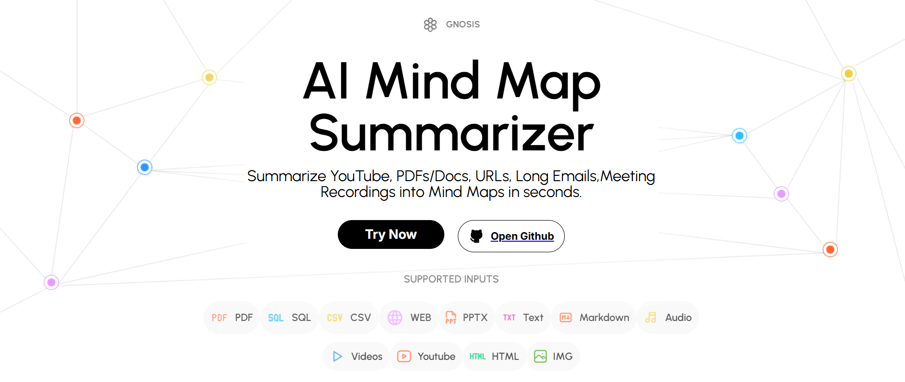
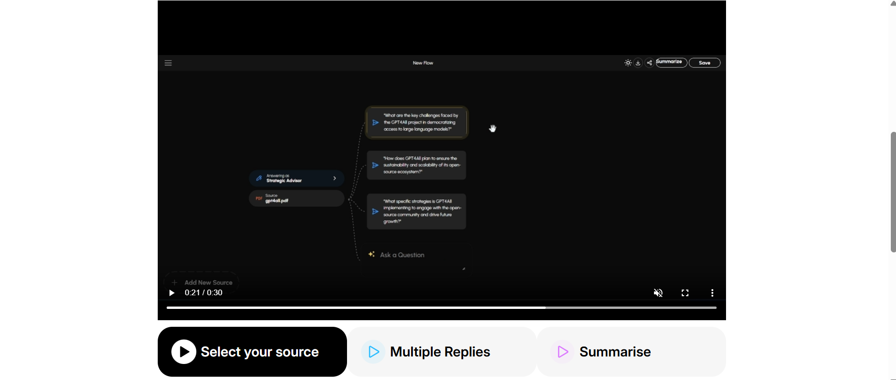
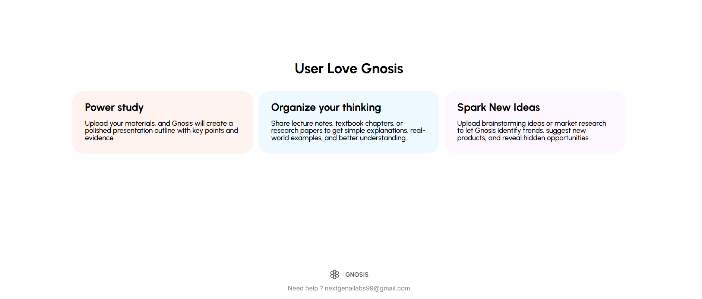

### 📁 Create Flow & Add Sources
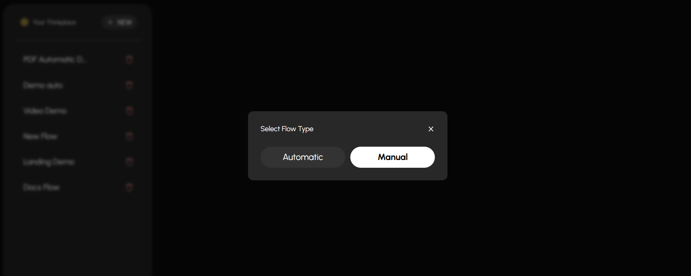
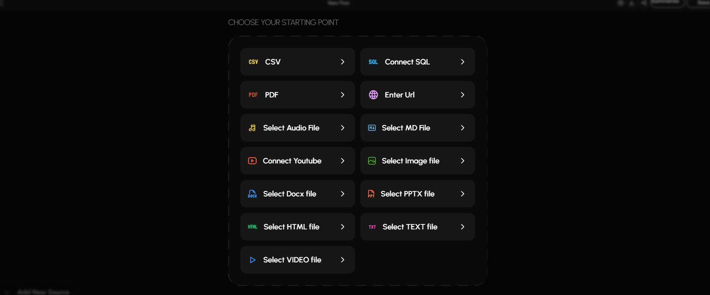
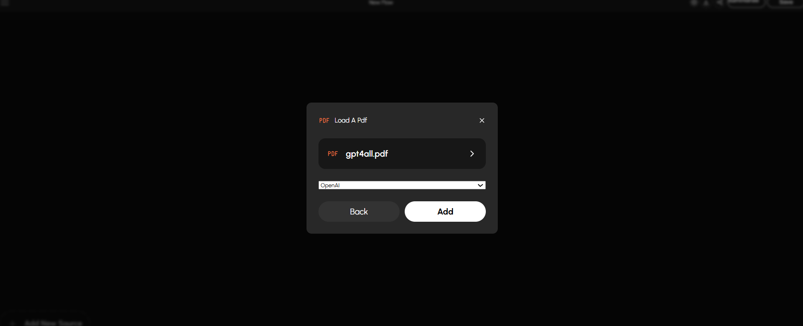

### 👤 Choose Agent / Persona
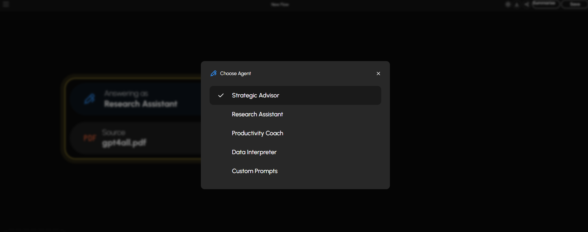

### 🤖 Follow-Up Questions & AI Responses
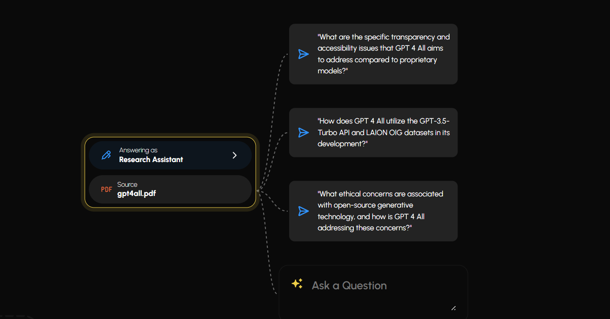
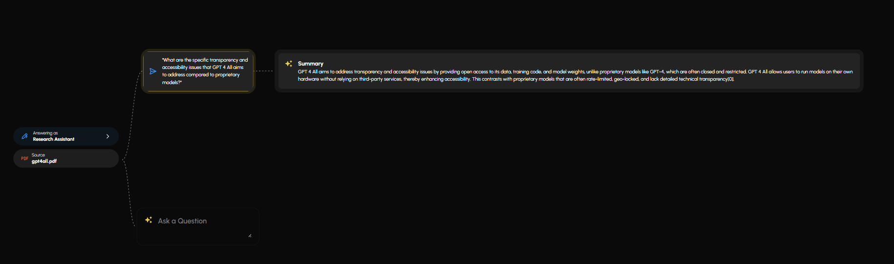

### ❓ Custom Q&A Interface
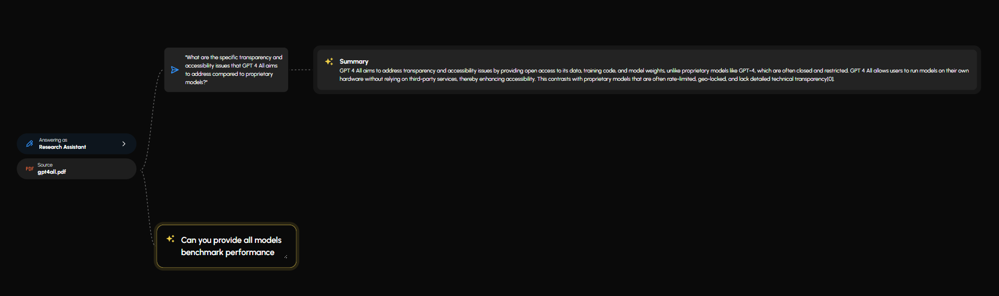
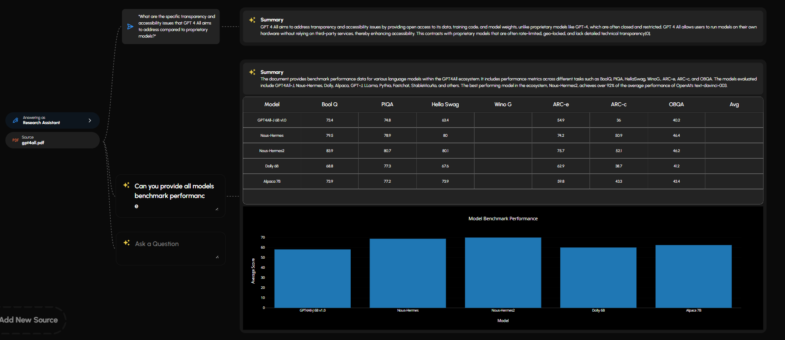

### ➕ Add More Sources & Continue Flow
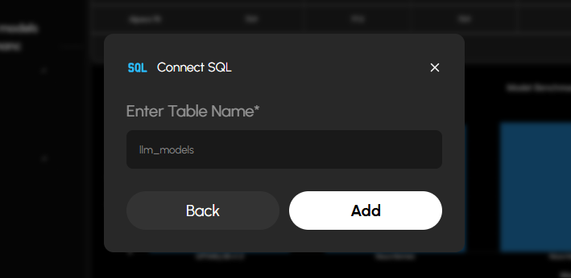
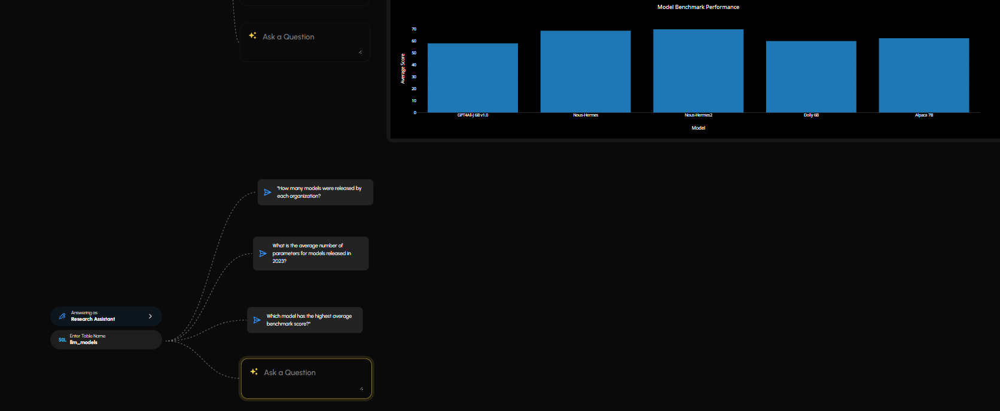
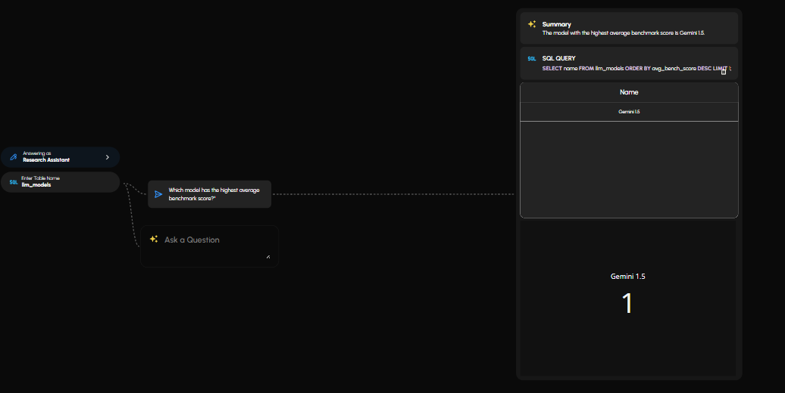
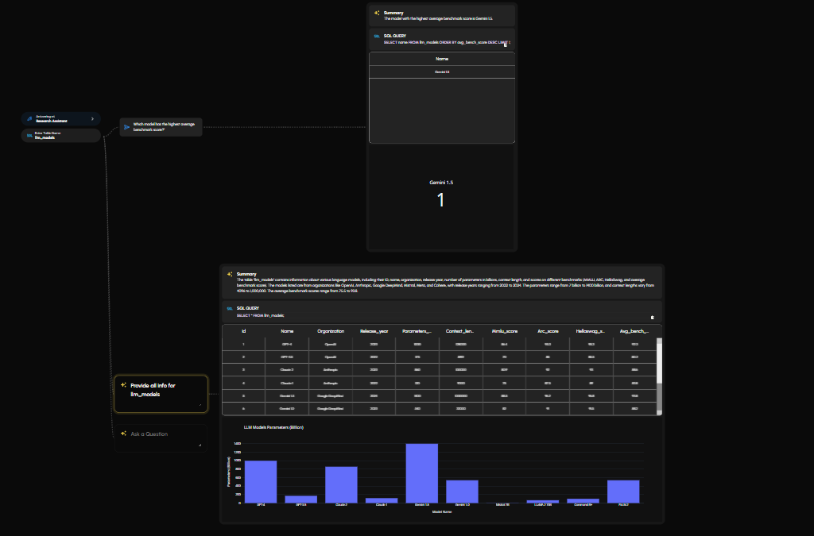

### 🔁 Ask Questions on Previous Responses
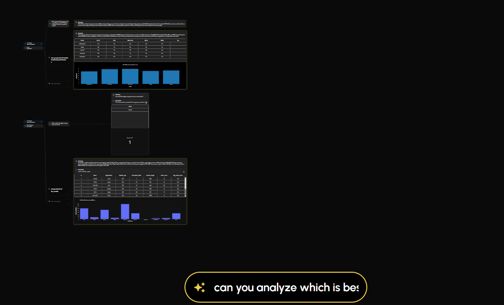
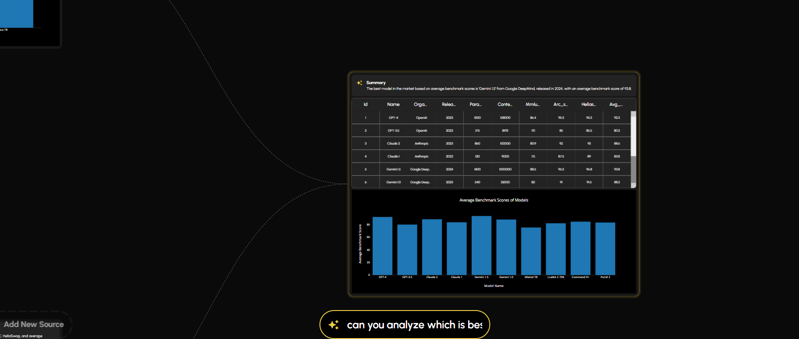

### 🧩 Visualize Complete Mind Map Flow
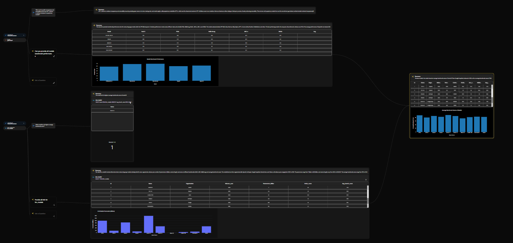

### 🧾 Summarize Complete Flow
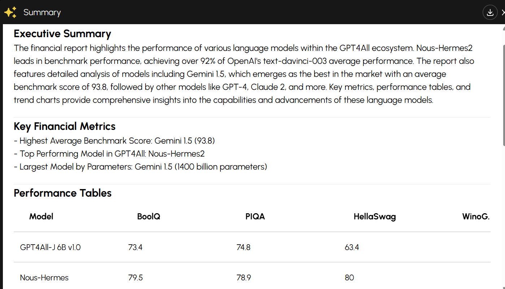
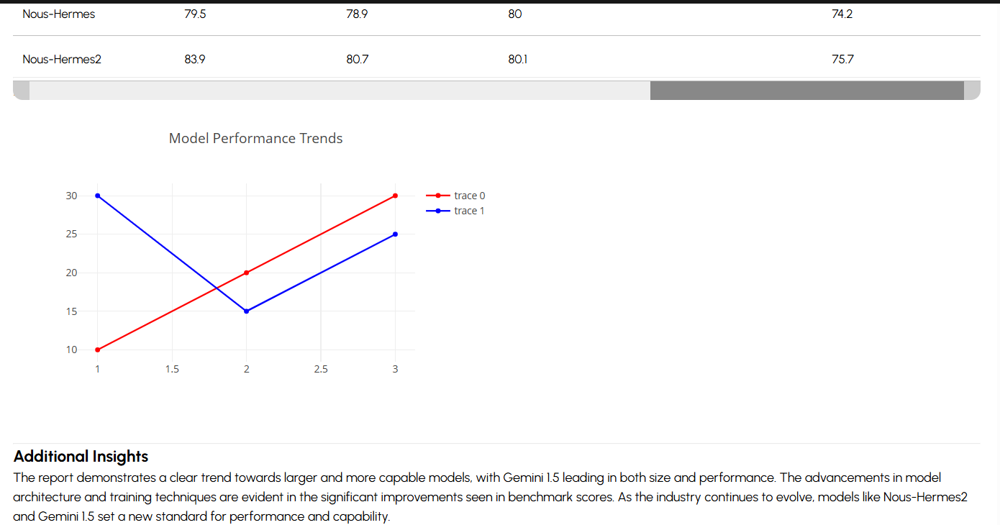

### ⚡ Auto Mind Map from PDFs, Videos, and More
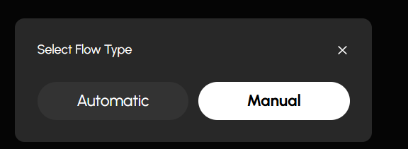
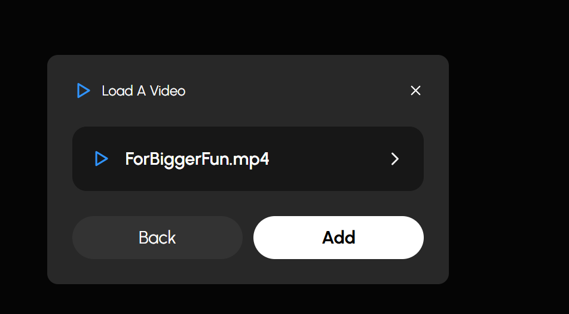
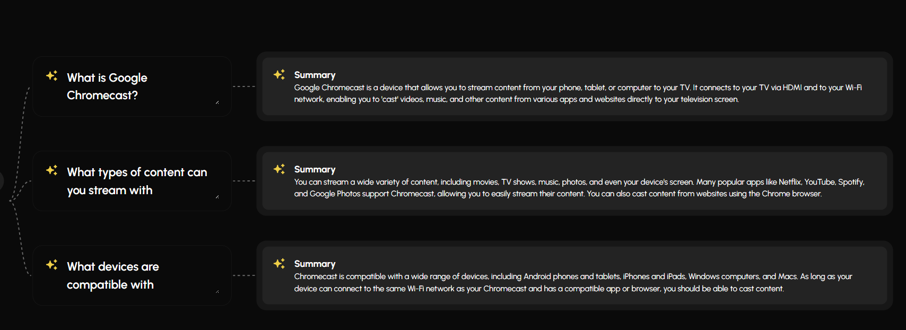

---

## 🛠️ Tech Stack

| Layer        | Tech |
|--------------|------|
| **Frontend** | ReactJS, CSS |
| **Backend**  | FastAPI (Python) |
| **AI Models**| OpenAI GPT-4o, Google Gemini Pro |
| **Storage**  | Local File System, AWS S3 |
| **Database** | MongoDB, SQLite |
| **Vector Store** | ChromaDB (configurable) |

---

## ⚙️ Setup Instructions

### 🔁 Clone the Repository

```bash
git clone https://github.com/NextGenAILabs/GenAIMindMapFlowBuilder.git
cd GenAIMindMapFlowBuilder
```

### 🔧 Backend Setup (FastAPI + Poetry)

```bash
cd backend
python -m venv .venv
source .venv/bin/activate  # or .venv\Scripts\activate (Windows)

pip install poetry
poetry install
uvicorn app:app --reload
```

### 💻 Frontend Setup (React)

```bash
cd frontend
npm install
npm run dev
```

---

## 🔐 Environment Variables

Create a `.env` file inside the `backend/` folder:

```env
# .env
mongo_db_url=
openai_api_key=
gemini_api_key=
aws_access_key_id=
aws_secret_access_key=
bucket_name=
```

> Replace values with actual credentials.

---

## 🧪 Example Workflow

1. Upload a `.pdf`, connect a SQL database, or paste a URL
2. AI reads and summarizes data
3. System builds a visual mind map
4. Ask follow-ups, skip them, or ask custom questions
5. Explore answers (text + table + graph)
6. Export final report as a shareable PDF

---

## 🤖 AI Integration Details

| Model          | Purpose |
|----------------|---------|
| **OpenAI GPT-4o** | NLP, summarization, Q&A, flow generation |
| **Google Gemini Pro** | Multimodal input (text, image, video), deeper analysis |

---

## 💡 Inspirations

- [NotebookLM (Google)](https://notebooklm.google/)
- [Obsidian Mind Map Plugin](https://obsidian.md/)
- [Miro](https://miro.com/)
- [Whimsical](https://whimsical.com/)
- [Notion AI](https://www.notion.so/product/ai)

---
